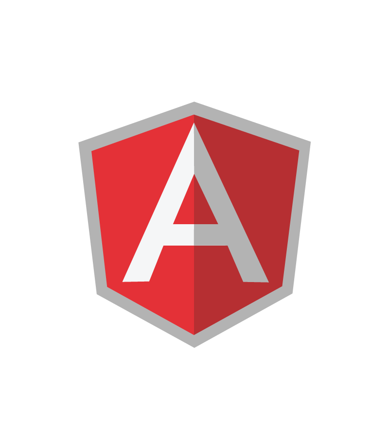
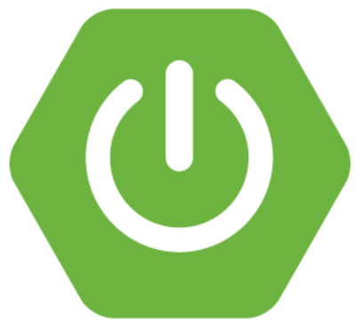

## Hi there 👋

### Programming Languages
 - I have experience using Java for creation API and access control, Angular , SQL and data modeling for creation of databases with database diagram, Dcoker, VPS, Python for development of Robotic Process Automation (RPA) using selenium, also working with PHP, Javascript for developing web applications/sites.

### Specialties
- Java, Springboot, Microservices, Angular, Python, PHP, Javascript, CSS, HTML, Java, SQL, Data Analisys, IoT, Web development.

<code></code>
<code></code>
<code></code>
<code></code>

 | 
|-|-|

***

#### [My portfolio](https://teonasnetto.github.io)

